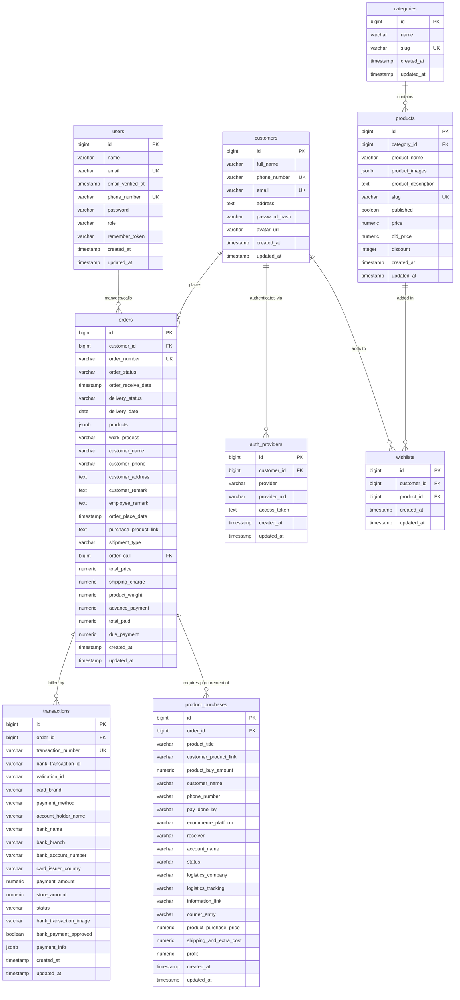

# SkyForceBD Database Design (PostgreSQL)

This document provides a detailed overview of the PostgreSQL database schema for the SkyForceBD application. SkyForceBD is a Laravel-based E-commerce and logistics/purchasing management system featuring multi-auth capabilities (Admin/Staff users and Customers), an order system that snapshots product data in JSONB format, external purchase tracking (e.g., Taobao, 1688), payment transactions, and Role-Based Access Control (RBAC).

---

## 1. Database Architecture & Relationships (ER Diagram)

Below is the Entity-Relationship diagram showcasing how tables relate to one another in the SkyForceBD database.



---

## 2. Table-by-Table Data Dictionary

All primary key columns in PostgreSQL are implemented as auto-incrementing `BIGSERIAL` (represented in Laravel as `$table->id()`).

### 2.1 Table: `users`
Represents backend administrator, moderator, and staff accounts.
* **Relations**: 1-to-Many with `orders` via `orders.order_call` (the representative assigned to handle the order).

| Column Name | PostgreSQL Type | Nullability | Constraints / Keys | Default Value | Description |
| :--- | :--- | :--- | :--- | :--- | :--- |
| `id` | `BIGSERIAL` | NOT NULL | `PRIMARY KEY` | *auto* | Unique identifier. |
| `name` | `VARCHAR(255)` | NOT NULL | | | User's full name. |
| `email` | `VARCHAR(255)` | NOT NULL | `UNIQUE` | | Primary email for login. |
| `email_verified_at`| `TIMESTAMP` | NULL | | | Time email was verified. |
| `phone_number` | `VARCHAR(255)` | NULL | `UNIQUE` | | Contact number. |
| `password` | `VARCHAR(255)` | NOT NULL | | | Bcrypt password hash. |
| `role` | `VARCHAR(255)` | NULL | | | User role tag. |
| `remember_token` | `VARCHAR(100)` | NULL | | | Session persistence token. |
| `created_at` | `TIMESTAMP` | NULL | | | Creation timestamp. |
| `updated_at` | `TIMESTAMP` | NULL | | | Last modification timestamp. |

---

### 2.2 Table: `customers`
Represents external client accounts placing orders on the store platform.
* **Relations**:
  * 1-to-Many with `auth_providers` (OAuth connections like Google/Facebook).
  * 1-to-Many with `orders` (orders placed by this customer).
  * 1-to-Many with `wishlists` (products wishlisted by this customer).

| Column Name | PostgreSQL Type | Nullability | Constraints / Keys | Default Value | Description |
| :--- | :--- | :--- | :--- | :--- | :--- |
| `id` | `BIGSERIAL` | NOT NULL | `PRIMARY KEY` | *auto* | Unique identifier. |
| `full_name` | `VARCHAR(255)` | NOT NULL | | | Customer's full name. |
| `phone_number` | `VARCHAR(255)` | NULL | `UNIQUE` | | Contact number (unique). |
| `email` | `VARCHAR(255)` | NULL | `UNIQUE` | | Primary email address. |
| `address` | `TEXT` | NULL | | | Default physical delivery address. |
| `password_hash` | `VARCHAR(255)` | NULL | | | Bcrypt password hash (null for OAuth-only users). |
| `avatar_url` | `VARCHAR(255)` | NULL | | | Path to customer profile image. |
| `created_at` | `TIMESTAMP` | NULL | | | Creation timestamp. |
| `updated_at` | `TIMESTAMP` | NULL | | | Last modification timestamp. |

---

### 2.3 Table: `auth_providers`
Stores social authentication providers (OAuth integration like Google, Facebook) linked to customers.
* **Relations**: Belongs to `customers` (`customer_id` references `customers.id` with `ON DELETE CASCADE`).

| Column Name | PostgreSQL Type | Nullability | Constraints / Keys | Default Value | Description |
| :--- | :--- | :--- | :--- | :--- | :--- |
| `id` | `BIGSERIAL` | NOT NULL | `PRIMARY KEY` | *auto* | Unique identifier. |
| `customer_id` | `BIGINT` | NOT NULL | `FOREIGN KEY` | | References `customers.id`. |
| `provider` | `VARCHAR(255)` | NOT NULL | | | Provider name (e.g., `'google'`, `'facebook'`). |
| `provider_uid` | `VARCHAR(255)` | NOT NULL | | | Remote user ID from provider. |
| `access_token` | `TEXT` | NULL | | | Provider OAuth token. |
| `created_at` | `TIMESTAMP` | NULL | | | Creation timestamp. |
| `updated_at` | `TIMESTAMP` | NULL | | | Last modification timestamp. |

---

### 2.4 Table: `categories`
Product categorization labels.
* **Relations**: 1-to-Many with `products`.

| Column Name | PostgreSQL Type | Nullability | Constraints / Keys | Default Value | Description |
| :--- | :--- | :--- | :--- | :--- | :--- |
| `id` | `BIGSERIAL` | NOT NULL | `PRIMARY KEY` | *auto* | Unique identifier. |
| `name` | `VARCHAR(255)` | NOT NULL | | | Category title. |
| `slug` | `VARCHAR(255)` | NOT NULL | `UNIQUE` | | URL slug for routing. |
| `created_at` | `TIMESTAMP` | NULL | | | Creation timestamp. |
| `updated_at` | `TIMESTAMP` | NULL | | | Last modification timestamp. |

---

### 2.5 Table: `products`
The main catalog of items available on the storefront.
* **Relations**:
  * Belongs to `categories` (`category_id` references `categories.id` with `ON DELETE CASCADE`).
  * 1-to-Many with `wishlists` (instances of this product saved by customers).
* **Note**: `badge` is listed in the Model's `$fillable` array but is not in the schema.

| Column Name | PostgreSQL Type | Nullability | Constraints / Keys | Default Value | Description |
| :--- | :--- | :--- | :--- | :--- | :--- |
| `id` | `BIGSERIAL` | NOT NULL | `PRIMARY KEY` | *auto* | Unique identifier. |
| `category_id` | `BIGINT` | NOT NULL | `FOREIGN KEY` | | References `categories.id`. |
| `product_name` | `VARCHAR(255)` | NOT NULL | | | Item name. |
| `product_images`| `JSONB` | NULL | | | Array of storage filepaths. |
| `product_description`| `TEXT` | NULL | | | HTML/Markdown or plain text desc. |
| `slug` | `VARCHAR(255)` | NOT NULL | `UNIQUE` | | URL slug for routing. |
| `published` | `BOOLEAN` | NOT NULL | | `FALSE` | Visibility status on storefront. |
| `price` | `NUMERIC(8,2)` | NOT NULL | | `0.00` | Active product unit price. |
| `old_price` | `NUMERIC(8,2)` | NULL | | | Original price (pre-discount). |
| `discount` | `INTEGER` | NULL | | | Discount percentage. |
| `created_at` | `TIMESTAMP` | NULL | | | Creation timestamp. |
| `updated_at` | `TIMESTAMP` | NULL | | | Last modification timestamp. |

---

### 2.6 Table: `wishlists`
A pivot table that acts as a many-to-many relationship mapping between customers and products.
* **Relations**:
  * Belongs to `customers` (`customer_id` references `customers.id` with `ON DELETE CASCADE`).
  * Belongs to `products` (`product_id` references `products.id` with `ON DELETE CASCADE`).

| Column Name | PostgreSQL Type | Nullability | Constraints / Keys | Default Value | Description |
| :--- | :--- | :--- | :--- | :--- | :--- |
| `id` | `BIGSERIAL` | NOT NULL | `PRIMARY KEY` | *auto* | Unique identifier. |
| `customer_id` | `BIGINT` | NOT NULL | `FOREIGN KEY` | | References `customers.id`. |
| `product_id` | `BIGINT` | NOT NULL | `FOREIGN KEY` | | References `products.id`. |
| `created_at` | `TIMESTAMP` | NULL | | | Creation timestamp. |
| `updated_at` | `TIMESTAMP` | NULL | | | Last modification timestamp. |

**Indexes / Unique Keys**:
* `UNIQUE (customer_id, product_id)`: Prevents a customer from adding the same product multiple times.

---

### 2.7 Table: `orders`
Captures all checkout records. Instead of hard-linking products via pivot tables which can mutate as products change name or price, this schema takes a snapshot of purchased items in a `products` JSONB column.
* **Relations**:
  * Belongs to `customers` (`customer_id` references `customers.id` with `ON DELETE SET NULL`).
  * Belongs to `users` (`order_call` references `users.id` with `ON DELETE SET NULL`).
  * 1-to-Many with `transactions` (payment logs for the order).
  * 1-to-Many with `product_purchases` (logistics purchases from China/etc. related to the order).

| Column Name | PostgreSQL Type | Nullability | Constraints / Keys | Default Value | Description |
| :--- | :--- | :--- | :--- | :--- | :--- |
| `id` | `BIGSERIAL` | NOT NULL | `PRIMARY KEY` | *auto* | Unique identifier. |
| `customer_id` | `BIGINT` | NULL | `FOREIGN KEY` | | References `customers.id`. |
| `order_number` | `VARCHAR(255)` | NOT NULL | `UNIQUE` | | E.g. `SKY-23052026-ABCDEFGH`. |
| `order_status` | `VARCHAR(255)` | NULL | | `NULL` | State: `order_request`, `responsed`, `accepted`, `rejected` (Enum: `OrderStatus`). |
| `order_receive_date` | `TIMESTAMP` | NOT NULL | | `CURRENT_TIMESTAMP`| Timestamp when received. |
| `delivery_status`| `VARCHAR(255)` | NULL | | `NULL` | State: `pending`, `processing`, `shipped`, `delivered`, `cancelled` (Enum: `DeliveryStatus`). |
| `delivery_date` | `DATE` | NULL | | | Promised or actual delivery date. |
| `products` | `JSONB` | NOT NULL | | | Array of product snapshots. |
| `work_process` | `VARCHAR(255)` | NOT NULL | | `'pending'` | Procurement state (Enum: `WorkProcess`). |
| `customer_name` | `VARCHAR(255)` | NULL | | | Snapshot of name at order time. |
| `customer_phone` | `VARCHAR(255)` | NOT NULL | | | Snapshot of phone at order time. |
| `customer_address`| `TEXT` | NULL | | | Snapshot of shipping destination. |
| `customer_remark`| `TEXT` | NULL | | | Special instructions from customer. |
| `employee_remark`| `TEXT` | NULL | | | Internal admin/staff comments. |
| `order_place_date`| `TIMESTAMP` | NULL | | | Timestamp order was confirmed. |
| `purchase_product_link`| `TEXT` | NULL | | | External purchase supplier link (e.g. Taobao). |
| `shipment_type` | `VARCHAR(255)` | NULL | | | Transit type: `air`, `sea`, `road` (Enum: `ShipmentType`). |
| `order_call` | `BIGINT` | NULL | `FOREIGN KEY` | | References `users.id` (handling agent). |
| `total_price` | `NUMERIC(12,2)` | NOT NULL | | `0.00` | Overall order cost. |
| `shipping_charge`| `NUMERIC(12,2)` | NULL | | `0.00` | Cost of transport. |
| `product_weight` | `NUMERIC(10,3)` | NULL | | | Weight of total items (e.g. in kg). |
| `advance_payment`| `NUMERIC(12,2)` | NULL | | `0.00` | Paid upfront (deposit). |
| `total_paid` | `NUMERIC(12,2)` | NULL | | `0.00` | Cumulative amount verified as paid. |
| `due_payment` | `NUMERIC(12,2)` | NULL | | `0.00` | Outstanding balance left. |
| `created_at` | `TIMESTAMP` | NULL | | | Creation timestamp. |
| `updated_at` | `TIMESTAMP` | NULL | | | Last modification timestamp. |

---

### 2.8 Table: `transactions`
Records online and manual (bank transfer) payment logs.
* **Relations**: Belongs to `orders` (`order_id` references `orders.id` with `ON DELETE CASCADE`).

| Column Name | PostgreSQL Type | Nullability | Constraints / Keys | Default Value | Description |
| :--- | :--- | :--- | :--- | :--- | :--- |
| `id` | `BIGSERIAL` | NOT NULL | `PRIMARY KEY` | *auto* | Unique identifier. |
| `order_id` | `BIGINT` | NOT NULL | `FOREIGN KEY` | | References `orders.id`. |
| `transaction_number`| `VARCHAR(255)`| NOT NULL | `UNIQUE` | | System generated unique identifier. |
| `bank_transaction_id`| `VARCHAR(255)`| NULL | | | Transaction reference from banks (manual transfer). |
| `validation_id` | `VARCHAR(255)`| NULL | | | ID from payment gateway. |
| `card_brand` | `VARCHAR(255)`| NULL | | | E.g. `'VISA'`, `'MasterCard'`. |
| `payment_method` | `VARCHAR(255)`| NULL | | | `'card'`, `'mobilebanking'`, `'banktransfer'`, etc. |
| `account_holder_name`| `VARCHAR(255)`| NULL | | | Sender account name. |
| `bank_name` | `VARCHAR(255)`| NULL | | | Payer bank name (e.g. `'Brac Bank'`). |
| `bank_branch` | `VARCHAR(255)`| NULL | | | Payer bank branch. |
| `bank_account_number`| `VARCHAR(255)`| NULL | | | Sender bank account number. |
| `card_issuer_country`| `VARCHAR(255)`| NULL | | | Payer card origin country. |
| `payment_amount` | `NUMERIC(12,2)`| NULL | | | Amount paid by sender. |
| `store_amount` | `NUMERIC(12,2)`| NULL | | | Net amount received (after fees). |
| `status` | `VARCHAR(255)`| NULL | | `NULL` | State: `pending`, `success`, `failed`, `canceled` (Enum: `TransactionStatus`). |
| `bank_transaction_image`| `VARCHAR(255)`| NULL| | | Path to deposit receipt upload. |
| `bank_payment_approved`| `BOOLEAN` | NULL | | | True if admin manually verified receipt. |
| `payment_info` | `JSONB` | NULL | | | Detailed raw gateway responses. |
| `created_at` | `TIMESTAMP` | NULL | | | Creation timestamp. |
| `updated_at` | `TIMESTAMP` | NULL | | | Last modification timestamp. |

---

### 2.9 Table: `product_purchases`
For orders requiring sourcing from third parties (e.g., procurement from Taobao, 1688, Amazon, etc.).
* **Relations**: Belongs to `orders` (`order_id` references `orders.id` with `ON DELETE CASCADE`).
* **Note**: Automatic profit calculation triggers on database updates: `profit = product_buy_amount - product_purchase_price - shipping_and_extra_cost`.

| Column Name | PostgreSQL Type | Nullability | Constraints / Keys | Default Value | Description |
| :--- | :--- | :--- | :--- | :--- | :--- |
| `id` | `BIGSERIAL` | NOT NULL | `PRIMARY KEY` | *auto* | Unique identifier. |
| `order_id` | `BIGINT` | NOT NULL | `FOREIGN KEY` | | References `orders.id`. |
| `product_title` | `VARCHAR(255)` | NOT NULL | | | Snapshot title. |
| `customer_product_link`| `VARCHAR(255)`| NULL | | | Store link clicked by customer. |
| `product_buy_amount`| `NUMERIC(12,2)`| NOT NULL | | `0.00` | Price paid by customer to store. |
| `customer_name` | `VARCHAR(255)` | NULL | | | Sourced client name. |
| `phone_number` | `VARCHAR(30)` | NULL | | | Sourced client phone. |
| `pay_done_by` | `VARCHAR(255)` | NULL | | | Username or staff ID who ordered. |
| `ecommerce_platform`| `VARCHAR(255)` | NULL | | | Procurement source (e.g. `'Taobao'`). |
| `receiver` | `VARCHAR(255)` | NULL | | | Logistics drop receiver. |
| `account_name` | `VARCHAR(255)` | NULL | | | Buying account identifier. |
| `status` | `VARCHAR(255)` | NOT NULL | | `'pending'` | Procurement: `pending`, `purchased`, `shipped`, `arrived`, `delivered`, `cancelled` (Enum: `PurchaseStatus`). |
| `logistics_company` | `VARCHAR(255)` | NULL | | | E.g. `'SF Express'`. |
| `logistics_tracking`| `VARCHAR(255)` | NULL | | | tracking number. |
| `information_link` | `VARCHAR(255)` | NULL | | | Supplier invoice or status url. |
| `courier_entry` | `VARCHAR(255)` | NULL | | | Warehouse entry code. |
| `product_purchase_price`| `NUMERIC(12,2)`| NULL | | | Wholesale price paid to supplier. |
| `shipping_and_extra_cost`| `NUMERIC(12,2)`| NOT NULL | | `0.00` | Logistics/customs extra charges. |
| `profit` | `NUMERIC(12,2)`| NOT NULL | | `0.00` | Net margin (`buy_amount - purchase_price - extra_cost`). |
| `created_at` | `TIMESTAMP` | NULL | | | Creation timestamp. |
| `updated_at` | `TIMESTAMP` | NULL | | | Last modification timestamp. |

---

### 2.10 CMS and Configuration Tables
These tables hold localized/static structures, page data, and settings. They make extensive use of `JSONB` columns to store structured content list configurations.

#### `additional_pages`
Stores general dynamic pages (About Us, Policy, FAQ, etc.).
* `id` `BIGSERIAL PK`
* `name` `VARCHAR(255)` (Page name)
* `slug` `VARCHAR(255) UNIQUE` (SEO URL slug)
* `content` `TEXT NULL` (HTML/Markdown content body)
* `published` `BOOLEAN DEFAULT FALSE` (Page visibility)
* `add_on_footer` `BOOLEAN DEFAULT FALSE` (Flag to pin page links inside the website footer)
* `created_at` / `updated_at` `TIMESTAMP NULL`

#### `banners`
Stores marketing sliders shown on homepage headers.
* `id` `BIGSERIAL PK`
* `image` `VARCHAR(255)` (Relative filepath to image asset)
* `link` `VARCHAR(255) NULL` (URL redirection target when clicked)
* `sort_order` `INTEGER DEFAULT 0` (Ascending display order priority)
* `created_at` / `updated_at` `TIMESTAMP NULL`

#### `about_us`
Defines structure of the customized About Us section.
* `id` `BIGSERIAL PK`
* `image_url` `VARCHAR(255) NULL` (Side profile photo)
* `heading` `VARCHAR(255)` (Main header, e.g. "We Deliver the Best")
* `heading_highlight` `VARCHAR(255) NULL` (Colored span tagline)
* `body` `TEXT` (Detailed descriptive block)
* `features` `JSONB NULL` (Structured bullet points list e.g. `["Nationwide delivery", "100% secure"]`)
* `cta_label` `VARCHAR(100) NULL` (Button label, e.g. "Learn More")
* `cta_link` `VARCHAR(255) NULL` (Button click action target URL)
* `created_at` / `updated_at` `TIMESTAMP NULL`

#### `offices`
Configuration of office details.
* `id` `BIGSERIAL PK`
* `office` `JSONB DEFAULT '[]'` (Array of office objects with fields like branch name, coordinates, address, phone)
* `created_at` / `updated_at` `TIMESTAMP NULL`

#### `countries`
Configures supported countries and shipping settings.
* `id` `BIGSERIAL PK`
* `country` `JSONB DEFAULT '[]'` (Array of countries and their respective logistics parameters)
* `created_at` / `updated_at` `TIMESTAMP NULL`

#### `ads_videos`
Promo videos container.
* `id` `BIGSERIAL PK`
* `video` `JSONB DEFAULT '[]'` (Array of YouTube URLs and video title metadata)
* `created_at` / `updated_at` `TIMESTAMP NULL`

#### `contacts`
Aggregated general shop details and social links.
* `id` `BIGSERIAL PK`
* `head_office` `TEXT NULL`
* `shop_office` `TEXT NULL`
* `licence` `VARCHAR(255) NULL` (Company business license or registration number)
* `email` `VARCHAR(255) NULL`
* `phone` `VARCHAR(255) NULL`
* `whatsapp` `VARCHAR(255) NULL`
* `facebook` `VARCHAR(255) NULL`
* `youtube` `VARCHAR(255) NULL`
* `instagram` `VARCHAR(255) NULL`
* `created_at` / `updated_at` `TIMESTAMP NULL`

---

## 3. Core System & Queue Tables

These tables are managed by the Laravel engine to coordinate jobs, caches, and user authentication tokens.

* **`password_reset_tokens`**: Matches security tokens to emails for authentication recovery.
  * `email` `VARCHAR(255) PRIMARY KEY`
  * `token` `VARCHAR(255)`
  * `created_at` `TIMESTAMP NULL`
* **`sessions`**: Session records for web browser clients.
  * `id` `VARCHAR(255) PRIMARY KEY`
  * `user_id` `BIGINT NULL`
  * `ip_address` `VARCHAR(45) NULL`
  * `user_agent` `TEXT NULL`
  * `payload` `TEXT`
  * `last_activity` `INTEGER`
* **`cache`** & **`cache_locks`**: Application data caching layer.
  * `cache` key/value store.
  * `cache_locks` locks manager to manage race conditions.
* **`jobs`**, **`job_batches`**, & **`failed_jobs`**: Job queues (e.g. email dispatching, external API synchronizations).

---

## 4. Spatie RBAC Role / Permission System

Role-based access control is configured via Spatie Laravel Permission. It manages relationships polymorphically, allowing assignments to users (`App\Models\User` model).

1. **`permissions`**: Holds system execution capabilities (e.g., `create-products`, `manage-orders`).
2. **`roles`**: Groups of permissions (e.g., `Super-Admin`, `Sales-Agent`).
3. **`model_has_permissions`** (Polymorphic Pivot): Direct capability assignment mapping.
   * `permission_id` references `permissions.id`
   * `model_type` (e.g., `'App\Models\User'`)
   * `model_id` (the ID of the user)
4. **`model_has_roles`** (Polymorphic Pivot): Role mapping.
   * `role_id` references `roles.id`
   * `model_type` (e.g., `'App\Models\User'`)
   * `model_id` (the ID of the user)
5. **`role_has_permissions`** (Pivot): Direct mapping connecting permissions to specific roles.

---

## 5. JSONB Schema Structures

PostgreSQL's native `JSONB` format is used to handle flexible arrays. Below are the structural designs of these payloads.

### 5.1 `orders.products`
This stores the exact snapshots of products selected by the customer.
```json
[
  {
    "name": "Mechanical Keyboard (K86)",
    "product_link": "https://taobao.com/item/123456",
    "quantity": 2,
    "unit_price": 4500.00,
    "total_price": 9000.00
  }
]
```

### 5.2 `products.product_images`
Simple array string structures pointing to storage files.
```json
[
  "products/k86-main.webp",
  "products/k86-angle.webp"
]
```

### 5.3 `about_us.features`
An array of string tag highlights.
```json
[
  "Fast Nationwide Delivery",
  "100% Genuine Procurement",
  "Real-time Tracking Updates"
]
```

### 5.4 `offices.office`
```json
[
  {
    "branch_name": "Dhaka HQ",
    "address": "SkyForce Tower, Road 11, Banani, Dhaka",
    "phone": "+8801700000000",
    "map_coordinates": "23.7937,90.4066"
  }
]
```

---

## 6. PostgreSQL Specific Recommendations

Because you are using PostgreSQL, we recommend taking advantage of its advanced features to guarantee performance and data integrity:

### 6.1 GIN Indexes on JSONB Columns
For querying within the `orders.products` jsonb snapshot or filtering products by their images array, standard B-Tree indexing is not sufficient. 
We recommend creating a Generalized Inverted Index (GIN) on JSONB columns:

```sql
-- GIN index for order products search
CREATE INDEX idx_orders_products ON orders USING gin (products);

-- GIN index for product images search
CREATE INDEX idx_products_images ON products USING gin (product_images);
```
With these indexes, queries like `WHERE products @> '[{"name": "Mechanical Keyboard (K86)"}]'` will run in millisecond time.

### 6.2 Partial (Conditional) Indexes
In order management, searching for orders that are pending, or orders with unpaid dues is a very frequent path. We can use PostgreSQL partial indexes to optimize these queries:

```sql
-- Index on orders having due payments
CREATE INDEX idx_orders_unpaid ON orders (due_payment) 
WHERE due_payment > 0;

-- Index on pending orders
CREATE INDEX idx_orders_pending_delivery ON orders (delivery_status) 
WHERE delivery_status = 'pending';
```

### 6.3 Foreign Key Indexing
Laravel migration schemas do not automatically add B-Tree indexes on foreign keys. When joining tables (such as `orders` to `customers` or `transactions` to `orders`), PostgreSQL does sequential scans if indexes are missing. Ensure indexes are present:

```sql
CREATE INDEX idx_orders_customer_id ON orders (customer_id);
CREATE INDEX idx_transactions_order_id ON transactions (order_id);
CREATE INDEX idx_product_purchases_order_id ON product_purchases (order_id);
CREATE INDEX idx_products_category_id ON products (category_id);
```
